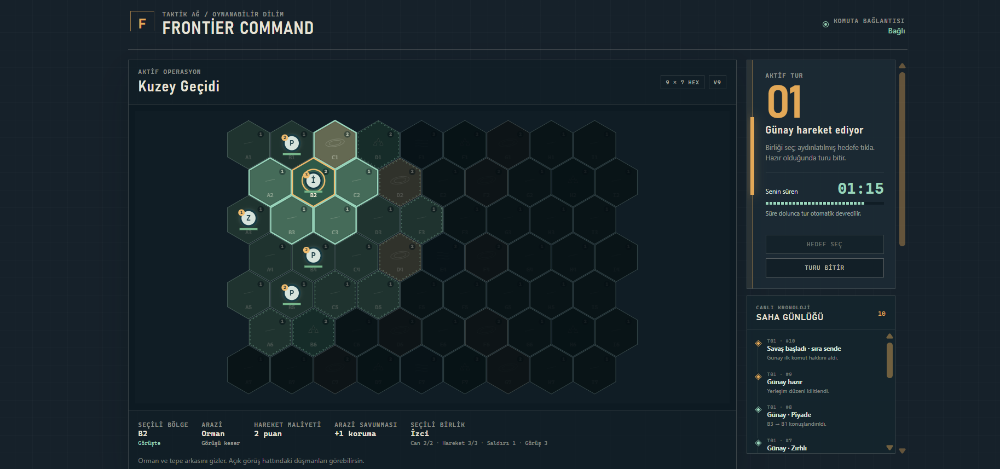
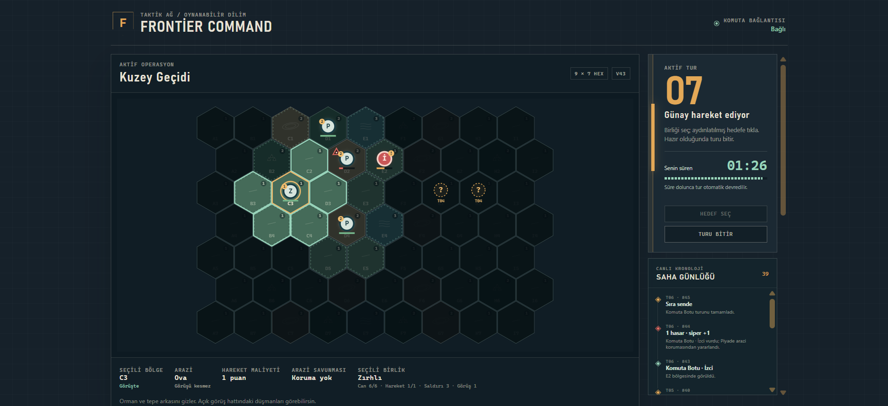
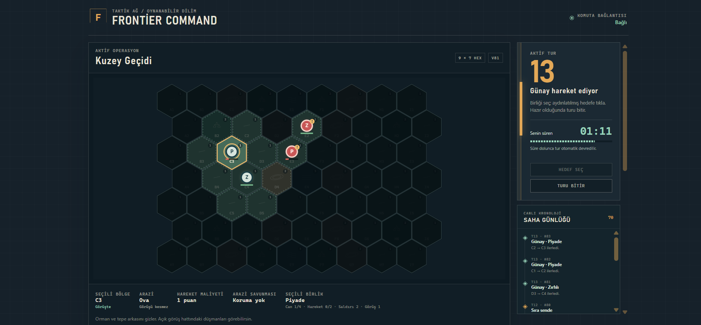
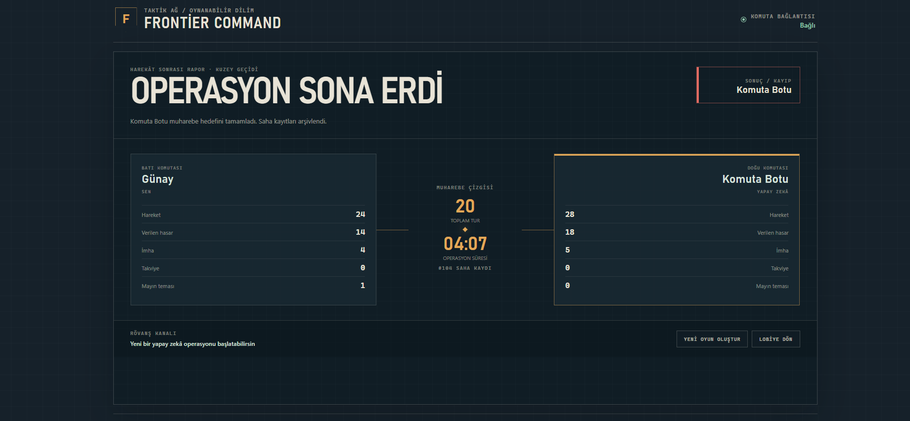
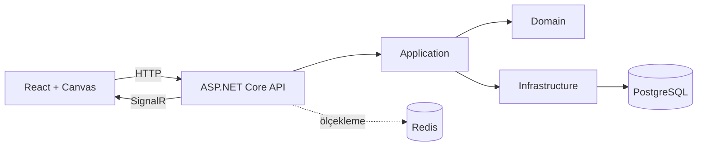

# Frontier Command

[](https://github.com/gunaykocan/frontier-command/actions/workflows/ci.yml)

**Sunucu otoriteli, iki oyunculu ve sıra tabanlı bir taktik strateji oyunu.**

Frontier Command; React/HTML5 Canvas istemcisi ile .NET 10 sunucusunu aynı monorepoda bir araya getiren, yerelde uçtan uca oynanabilir bir portföy projesidir. Oyuncular birliklerini yerleştirir, savaş sisi altında keşif yapar ve süreli turlarda başka bir oyuncunun veya sunucuda çalışan yapay zekânın hattını kırmaya çalışır.

## Oynanıştan görüntüler

### İlk temas ve görüş alanı



### Savaş sisi altında keşif



### İleri safha çatışması



### Harekât sonrası rapor



## Projenin durumu

Oynanabilir alfa sürümü tamamlandı. Tek oyunculu yapay zekâ veya iki ayrı tarayıcı oturumuyla multiplayer maç oluşturma, yerleştirme, hareket, çatışma, tur zaman aşımı, savaş sisi, gizli bölgeler, maç sonucu ve rövanş akışları oynanabilir. Oyun durumu PostgreSQL'de kalıcıdır; değişiklikler SignalR ile oyunculara anlık iletilir.

Kalite kontrolü 82 backend testi, 6 frontend testi ve üretim derlemesinden oluşur. GitHub Actions, her `main` gönderiminde ve pull request'te bu kontrolleri otomatik çalıştırır.

## Teknik açıdan öne çıkanlar

- **Sunucu otoriteli oyun modeli:** istemci sonuç üretmez; komut gönderir, kurallar backend'de doğrulanır.
- **Oyuncuya özel veri görünümü:** görünmeyen rakip birlikleri yalnızca arayüzde saklanmaz, HTTP ve SignalR yanıtlarından sunucuda çıkarılır.
- **Eşzamanlılık güvenliği:** maç sürümü, çakışan hamlelerin ve aynı turun iki kez sonlandırılmasının önüne geçer.
- **Kalıcı tur sayacı:** tur bitiş zamanı veritabanında tutulur; oyuncular bağlı değilken de süre dolabilir.
- **Sunucu taraflı yapay zekâ:** bot, insan oyuncuyla aynı hareket, saldırı, görüş ve tur kurallarını kullanır.
- **Katmanlı backend:** Domain, Application, Infrastructure ve API sorumlulukları ayrıdır.
- **Gerçek altyapı testi:** Docker üzerindeki PostgreSQL ve Redis ile iki oyunculu uçtan uca smoke senaryoları bulunur.

## Teknoloji tabanı

- Frontend: React 19, TypeScript, Vite ve HTML5 Canvas
- Backend: ASP.NET Core, .NET 10 LTS ve Clean Architecture
- Gerçek zamanlı iletişim: SignalR
- Kalıcı veri: PostgreSQL ve Entity Framework Core
- Önbellek/ölçekleme: Redis; SignalR backplane isteğe bağlıdır
- Sözleşmeler: `shared/contracts` altında JSON Schema

## Klasör yapısı

```text
.
├── frontend/                    React arayüzü ve Canvas taktik alanı
├── backend/
│   ├── Api/                     HTTP uçları, SignalR hub ve başlangıç
│   ├── Api.Tests/               Kimlik, görünürlük ve zaman aşımı testleri
│   ├── Application/             Kullanım senaryoları ve portlar
│   ├── Domain/                  Oyun modeli ve kurallar
│   ├── Domain.Tests/            Saf oyun kuralı testleri
│   ├── Infrastructure/          PostgreSQL ve Redis adaptörleri
│   └── Infrastructure.Tests/    Migration ve veri katmanı testleri
├── shared/contracts/            İstemci-sunucu sözleşmeleri
├── .github/workflows/ci.yml     Otomatik test ve üretim derlemesi
└── compose.yaml                 Yerel PostgreSQL ve Redis servisleri
```

## Mimari



`Domain` başka bir katmana bağlı değildir. Sunucu oyun durumunun otoritesidir; istemci yalnızca komut gönderir, doğrulanmış ve kalıcı hale getirilmiş sonuçlar SignalR üzerinden yayınlanır.

Katmanların sorumlulukları, bir hamlenin yaşam döngüsü, savaş sisinin sunucuda nasıl gizlendiği ve test yaklaşımı [Türkçe mimari belgesinde](docs/architecture.tr.md) ayrıntılı olarak açıklanır.

## Gereksinimler

- Node.js 24 LTS önerilir; Node.js 22.12+ da desteklenir
- pnpm 11
- .NET 10 SDK
- Docker Desktop veya uyumlu bir Docker Compose kurulumu

## Yerel çalıştırma

Önce örnek ortam dosyasını kopyalayın ve `.env` içindeki parolayı yalnızca yerel makinenizde kullanacağınız bir değerle değiştirin:

```powershell
Copy-Item .env.example .env
```

Docker Compose bu parolayı PostgreSQL konteynerine verir. Aynı değeri API bağlantısına güvenli biçimde kaydedin; aşağıdaki komutta `YOUR_LOCAL_PASSWORD` bölümünü değiştirin:

```powershell
dotnet user-secrets set "ConnectionStrings:GameDatabase" "Host=localhost;Port=5432;Database=game;Username=game;Password=YOUR_LOCAL_PASSWORD" --project backend/Api
```

`.env` ve .NET User Secrets Git'e eklenmez. Ardından veri servislerini başlatın:

```powershell
docker compose up -d
```

Depoya sabitlenmiş .NET araçlarını bir kez geri yükleyin:

```powershell
dotnet tool restore
```

Backend'i başlatın:

```powershell
cd backend
dotnet restore
dotnet run --project Api/Game.Api.csproj
```

Development ortamında bekleyen EF Core migration'ları uygulama açılışında otomatik uygulanır. Üretimde `Database__MigrateOnStartup` varsayılan olarak kapalıdır; migration uygulama adımı dağıtım sürecinde açıkça çalıştırılmalıdır.

Yeni bir model değişikliğinden sonra migration üretmek için depo kökünden şu komutu çalıştırın:

```powershell
$env:ConnectionStrings__GameDatabase = "Host=localhost;Port=5432;Database=game;Username=game;Password=YOUR_LOCAL_PASSWORD"
dotnet ef migrations add MigrationName --project backend/Infrastructure --startup-project backend/Api --output-dir Persistence/Migrations
```

Frontend'i ayrı bir terminalde başlatın:

```powershell
cd frontend
pnpm install
pnpm dev
```

Arayüz `http://localhost:5173`, API ise `http://localhost:5080` adresinde açılır. Vite geliştirme sunucusu `/api`, `/health` ve `/hubs` isteklerini API'ye yönlendirir.

Lobide **Yapay zekâya karşı oyna** seçildiğinde sunucu ikinci koltuğa hazır bir bot ekler. İnsan oyuncu yerleşimini tamamladıktan sonra savaş başlar. Bot kendi turunda görünür bir saldırı fırsatını önceliklendirir; saldırı yoksa birliklerini görünen düşmana veya rakip komuta kenarına doğru ilerletir ve turu insana geri verir.

PostgreSQL, API ve Redis çalışırken iki bağımsız oyuncu oturumu, SignalR güncellemeleri, hareket, tur devri, saldırı, gizli bölge, oturum geri yükleme, rövanş ve araziye bağlı görüş hattını gerçek altyapıda sınamak için:

```powershell
cd frontend
pnpm smoke:multiplayer
```

Başarılı çalıştırma `status: passed`, tamamlanma zamanı, yeni rövanş kimliği, tarafların değiştiği ve arazi görüşünün doğrulandığı bilgisini yazdırır. Görüş senaryosu rövanşta yenilenen oyuncu oturumlarıyla canlı bağlantıyı yeniden kurar; tepe arkasındaki düşmanın ve hareket olayının gizlenmesini, yandan yaklaşınca görünmesini ve geri çekilince yeniden gizlenmesini sınar. Test maçları inceleme amacıyla veritabanında `Docker E2E` ve `Replay` önekleriyle kalır.

Sayaç hesaplarını bağımsız sınamak için `frontend` klasöründe `pnpm test` çalıştırılır. Gerçek süre dolumunu ve iki oyuncunun da bağlantısı kesildiğinde tur devrini sınamak için `pnpm smoke:timer` kullanılır. Bu test iki gerçek 90 saniyelik tur bekler (yaklaşık üç dakika); test maçı `Timer E2E` önekiyle veritabanında kalır.

## Hazır uçlar

- `GET /health`: temel API sağlık kontrolü
- `GET /api/system/status`: yapılandırılan altyapı bileşenleri
- `GET /api/matches`: PostgreSQL üzerindeki oyunların salt okunur listesi
- `POST /api/matches`: ev sahibi oyuncuyla oyun oluşturur
- `GET /api/matches/{id}`: doğrulanmış oyuncu oturumuna özel, görüş alanına göre filtrelenmiş oyun görünümünü döndürür
- `POST /api/matches/{id}/players`: ikinci oyuncuyu oyuna ekler
- `POST /api/matches/{id}/deployment/placements`: oyuncunun birliğini kendi başlangıç alanında konumlandırır
- `POST /api/matches/{id}/deployment/ready`: oyuncunun yerleşimini kilitler; iki taraf hazırsa savaşı başlatır
- `POST /api/matches/{id}/moves`: doğrulanmış oyuncu oturumu ve sürüm kontrolüyle birim hamlesi uygular
- `POST /api/matches/{id}/attacks`: komşu düşman birliğine hasar uygular
- `POST /api/matches/{id}/turns/end`: aktif oyuncunun turunu sonlandırır
- `POST /api/matches/{id}/rematch/request`: tamamlanan maç için oyuncunun rövanş talebini kaydeder
- `POST /api/matches/{id}/rematch/accept`: rakibin talebini kabul eder ve tarafları değiştirilmiş yeni maçı kurar
- `POST /api/matches/{id}/rematch/enter`: talebi başlatan oyuncunun bağlı rövanşa güvenli biçimde geçmesini sağlar
- `GET /api/session`: geçerli misafir oturumunu yeniler ve oyuncuyu maçına döndürür
- `DELETE /api/session`: misafir oturumunu güvenli biçimde sonlandırır
- `/hubs/game`: SignalR bağlantısı ve oyun grupları

SignalR hub bağlantı hazır olayını gönderir, istemcileri maç gruplarına alıp çıkarır ve commit edilen her oyun aksiyonundan sonra `MatchUpdated` olayını yayınlar.

Oyun oluşturma veya katılma işleminden sonra sunucu, şifrelenmiş ve imzalanmış oyuncu oturumunu `HttpOnly`, `SameSite=Lax` bir çerezde saklar. Hamle isteğindeki oyuncu kimliği istemciden kabul edilmez; doğrulanmış oturumdan alınır. Sayfa yenilendiğinde istemci `GET /api/session` üzerinden aynı maça geri döner.

## İlk oyun kuralları

- İkinci oyuncu katılınca veya yapay zekâ modu seçilince yerleştirme aşaması başlar; her oyuncu 1 İzci, 3 Piyade ve 1 Zırhlı olmak üzere beş birlikle başlar. İzci, öncü piyade ve zırhlı B3/B4/B5 (doğuda H3/H4/H5), iki ek piyade A4/A5 (doğuda I4/I5) hücrelerine yerleşir.
- Beş birlikli düzen yeni oyunlarda ve rövanşta kullanılır; daha önce yerleştirmesi yapılmış veya başlamış maçların orduları değiştirilmez. Harita 9×7 ve ortak tur süresi 90 saniye olarak kalır.
- Batı oyuncusu A-B, doğu oyuncusu H-I sütunlarındaki boş hücrelere birliklerini yerleştirir.
- Her iki oyuncu da yerleşimini “Hazırım” ile kilitlediğinde savaş başlar ve Batı oyuncusu ilk hamleyi yapar.
- İzci 2 can / 3 hareket / 1 saldırı, Piyade 4 / 2 / 2, Zırhlı 6 / 1 / 3 değerleriyle başlar.
- İzci 3, Piyade ve Zırhlı 1 hex görüş sağlar; ordunun toplam görüş alanı bütün birliklerin görüşlerinin birleşimidir.
- Ateş açan birlik, rakibinin sonraki turu bitene kadar görünür kalır. Bu yalnızca saldırganın hücresini açar; çevresinde ek görüş sağlamaz. Elle veya süre dolumuyla tur devri aynı kuralı uygular.
- Daha önce görülüp sis içinde kaybolan düşmanın son gözlenen hücresi kesik çizgili `?` ve tur numarasıyla işaretlenir. Bu bir asker değil, eski keşif kaydıdır; can bilgisi içermez, saldırı hedefi veya hareket engeli olmaz. Eski hücre yeniden görülüp düşman orada bulunamazsa iz silinir.
- Keşif kayıtları oyuncu bazında PostgreSQL'de saklanır; gizli hareket veya görülmeyen bir kayıp kaydı güncellemez. Yenileme ve bağlantı yenileme kayıtları korur; rövanş yeni kayıtlarla başlar.
- Orman ve tepe görüş hattını keser; engel hücresi görünür, arkasındaki hücreler başka bir birlik tarafından görülmüyorsa gizlenir. Ova ve bataklık görüşü kesmez.
- Komşu hücreler her zaman görüş içindedir. Birliğin üzerinde durduğu orman veya tepe kendi görüşünü kapatmaz; tepe ek görüş menzili sağlamaz. Hat iki hex'in tam sınırından geçiyorsa iki yandan biri açık olduğu sürece görüş korunur.
- Yerleştirme aşamasında oyuncunun kendi başlangıç alanı bütünüyle görünür. Arayüz seçili hücrenin görüş durumunu ve arazinin görüşü kesip kesmediğini gösterir.
- Savaş ve yerleştirme sırasında güncel görüş dışındaki düşman birlikleri HTTP/SignalR görünümüne gönderilmez. Saha olaylarında ise olay anındaki görüş esas alınır: sonradan keşfedilen hücreler eski gizli hamleleri açığa çıkarmaz. Maç tamamlandığında tam rapor açılır.
- Birlikler bitişik ve boş bir hex bölgesine ilerler; Ova 1, Orman 2, Tepe 2, Bataklık 3 hareket puanı harcatır.
- Orman ve tepe savunan birliğe 1 koruma sağlar; saldırı hasarı yine de en az 1 olur. Ova ve bataklık savunma sağlamaz.
- Birliğin kalan hareket puanı hedef arazinin maliyetini karşılamıyorsa hamle reddedilir.
- Birlik turunda bir kez komşu düşmana saldırabilir; saldırı kalan hareketini tüketir.
- Oyuncu aksiyonlarını tamamladıktan sonra turu açıkça rakibine geçirir.
- Savaşta oyuncunun tüm birlikleri için ortak 90 saniye vardır. Hamle yapmak veya sayfayı yenilemek süreyi uzatmaz; oyuncu isterse turunu erken bitirebilir. Yerleştirme aşaması süresizdir.
- Son 15 saniyede sayaç kırmızıya döner ve yazılı uyarı gösterir. Süre dolunca yapılan hamleler korunur, kalan hareketler tükenir ve rakibe yeni bir 90 saniye verilir. Saha günlüğünde süre dolumu ayrıca belirtilir.
- Bitiş saati PostgreSQL'de saklanır; istemciye bitiş saati ve sunucu zamanı gönderilir. Ekrandaki sayaç yalnızca gösterimdir. Süresi bitmiş hamleler, saldırılar ve elle tur bitirme istekleri sunucu tarafından reddedilir.
- Sunucu süresi biten turları yaklaşık saniyede bir kontrol eder; oyuncular bağlı olmasa da devreder. Sürüm denetimi eşzamanlı hamlelerin veya birden fazla sunucu işçisinin aynı turu iki kez devretmesini önler. Kayıt tamamlandıktan sonra oyuncuya özel görüşler SignalR üzerinden gönderilir.
- Sunucu kapalıyken işlem yapılmaz. Yeniden açıldığında geçmiş bitiş saati kontrol edilir, yalnızca bir tur devredilir ve yeni oyuncuya tam süre verilir. Bu özelliğin ilk şema geçişinde mevcut aktif maçlar yeni bir 90 saniyelik süre alır; eski sonuçlar ve olaylar korunur.
- Yerleşim, hareket, saldırı, tur değişimi ve maç sonucu olayları sıralı olarak PostgreSQL'de saklanır; arayüz bunları Saha Günlüğü ve harita efektleriyle gösterir.
- Her yeni maçta başlangıç alanları dışında iki takviye ve iki mayın bölgesi gizlenir; koordinatlar tetiklenene kadar istemciye gönderilmez.
- Takviye bölgesi aynı türden, o tur kullanılamayan yeni bir birlik getirir; mayın mevcut canın yaklaşık yarısını götürür ve her bölge yalnızca bir kez çalışır.
- İstemcinin gönderdiği maç sürümü güncel değilse aksiyon reddedilir.
- Birliğini rakibin harita kenarına ulaştıran veya tüm düşman birliklerini yok eden oyuncu kazanır.
- Tamamlanan maçta süre ve oyuncu başına hareket, hasar, imha, takviye ve mayın istatistikleri harekât sonrası raporunda gösterilir.
- Bir oyuncu rövanş ister, rakibi kabul ederse yeni maç doğrudan yerleştirme aşamasında açılır; oyuncu adları korunur ve doğu-batı tarafları değişir.
- Önceki maç sonucu ve olay günlüğü arşiv niteliğinde korunur; iki oyuncu da yeni rövanş oturumuna otomatik aktarılır.

## Kodları öğrenerek inceleme

Keşif sistemindeki dosyalar, gerçek kod örnekleri, katmanların neden ayrıldığı ve test senaryoları [Türkçe keşif rehberinde](docs/reconnaissance-walkthrough.tr.md) açıklanır. `smoke:multiplayer` ayrıca eski izin sabit kalmasını, yeniden bağlantıda korunmasını, boş hücre tekrar görülünce veritabanından silinmesini ve olay geçmişinin gizliliğini sınar.

Eski aktif maçlarda daha önce tutulmamış keşif kayıtları uydurulmaz; yeni gözlemlerle oluşur. Önceden kaydedilmiş olaylarda gözlem bilgisi olmadığı için rakibin eski saha olayları oyun sürerken açılmaz; kendi olayların, genel tur olayları ve tamamlanan maçın tam raporu korunur.

## Yapılandırma

Yerel PostgreSQL parolası `.env` ve .NET User Secrets içinde tutulur; depoya kaydedilmez. Üretimde de bağlantı bilgilerini dosyaya yazmak yerine ortam değişkenleri veya secret manager kullanın:

```text
ConnectionStrings__GameDatabase
ConnectionStrings__Redis
Redis__UseSignalRBackplane
Database__MigrateOnStartup
PlayerSessions__CookieName
PlayerSessions__LifetimeHours
PlayerSessions__KeyDirectory
Cors__Origins__0
```

Tek backend örneğinde Redis backplane kapalıdır. Birden fazla API örneğine geçildiğinde `Redis__UseSignalRBackplane=true` ayarlanabilir.

Oyuncu oturumları ASP.NET Core Data Protection ile korunur. Üretim veya birden fazla API örneğinde Data Protection anahtar halkası kalıcı ve tüm API örneklerince paylaşılan güvenli bir depoda tutulmalıdır.

## Yol haritası

1. README'ye kısa bir oynanış GIF'i eklemek.
2. Temel kullanıcı akışları için React etkileşim testlerini genişletmek.
3. Yapay zekâya kolay/orta zorluk seçenekleri ve farklı stratejiler eklemek.
4. Oyun dengesini ölçmek için kayıtlı maçlardan denge metrikleri üretmek.
5. JSON Schema üzerinden C# ve TypeScript tip üretimini otomatikleştirmek.
