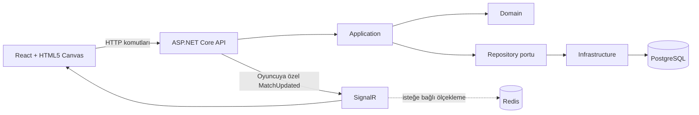
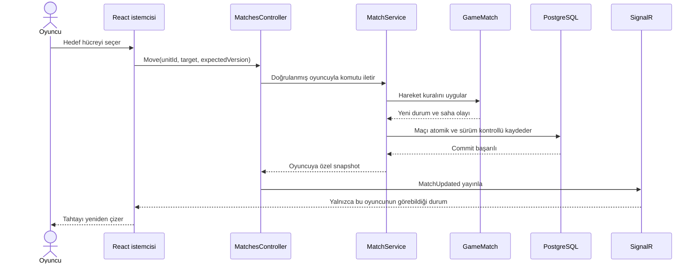

# Frontier Command mimarisi

Bu belge, Frontier Command'ın teknik kararlarını ve bir oyuncu komutunun sistemde nasıl işlendiğini açıklar. Amaç yalnızca klasörleri listelemek değil, her katmanın neden var olduğunu göstermektir.

## Genel görünüm

Bağımlılık yönü oyun kurallarını dış teknolojilerden korur. `Domain` katmanı HTTP, SignalR, Entity Framework veya React hakkında bilgi sahibi değildir. Bu nedenle hareket, saldırı, görüş ve süre kuralları veri tabanı olmadan birim testleriyle çalıştırılabilir.

## Katmanların sorumluluğu

### Domain

Oyunun doğruluk kaynağıdır. Maç, oyuncu, birlik, arazi, özel bölge, görüş ve olay modelleri burada bulunur. Bir hamlenin geçerli olup olmadığına bu katman karar verir.

### Application

Kullanım senaryolarını yönetir. API'den gelen komutu alır, oyuncu yetkisini ve beklenen maç sürümünü doğrular, Domain davranışını çalıştırır ve sonucu repository portu üzerinden kaydeder. Tek oyunculu moddaki bot planlayıcısı da bu katmandadır; seçtiği hamleleri insan oyuncuyla aynı Domain metotları üzerinden uygular.

### Infrastructure

Application tarafından tanımlanan kalıcılık portlarını uygular. Entity Framework Core ile PostgreSQL'e erişir; migration'lar veri modelinin sürümlenmesini sağlar. Redis, birden fazla API örneğinde SignalR mesajlarını dağıtmak için isteğe bağlıdır.

### API

HTTP uçlarını, oyuncu oturumunu, hata dönüşümünü, SignalR yayınını ve süresi dolan turları izleyen arka plan işçisini barındırır. Oyun kuralı üretmez; dış dünya ile uygulama katmanı arasında sınır görevi görür.

### Frontend

Oyuncunun görebildiği sunucu görünümünü React bileşenleri ve HTML5 Canvas ile sunar. İstemci hamle sonucunu kendi başına kesinleştirmez; komutu gönderir ve sunucunun onayladığı yeni görünümü işler.

## Bir hamlenin yaşam döngüsü

`expectedVersion`, oyuncunun eski bir ekran üzerinden komut göndermesi durumunda güncel maçı yanlışlıkla ezmesini önler. Bildirim yalnızca veri tabanı kaydı başarıyla tamamlandıktan sonra yayınlanır.

## Savaş sisi ve bilgi güvenliği

Savaş sisi yalnızca Canvas üzerinde koyu bir katman değildir. Backend her oyuncu için ayrı bir maç görünümü üretir:

1. Oyuncunun birliklerinden görüş alanı hesaplanır.
2. Görüş dışındaki canlı düşman birlikleri snapshot'tan çıkarılır.
3. Görülmüş fakat daha sonra kaybolmuş düşman için yalnızca son gözlem bilgisi gönderilir.
4. Saha olayları, olay gerçekleştiği andaki görünürlüğe göre filtrelenir.
5. Maç tamamlanınca harekât sonrası raporda tam bilgi açılır.

Bu yaklaşım, tarayıcı geliştirici araçlarını kullanan bir oyuncunun gizli rakip konumlarını ağ yanıtlarından öğrenmesini engeller.

## Tur zaman aşımı

Sayaç ekran bileşeninde hesaplanıyor gibi görünse de yetki sunucudadır. PostgreSQL'de kesin bir tur bitiş zamanı saklanır. Arka plan işçisi süreyi kontrol eder, süresi dolan turu sürüm denetimiyle bir kez sonlandırır ve yeni durumu oyunculara yayınlar.

Bu sayede sayfa yenilemek süreyi başlatmaz, istemci saatini değiştirmek avantaj sağlamaz ve iki oyuncu çevrimdışı olsa bile sunucu çalıştığı sürece tur ilerler.

## Test yaklaşımı

- Domain testleri hareket, çatışma, görüş, özel bölgeler ve zaman kurallarını sınar.
- API testleri oyuncu oturumu, özel snapshot üretimi ve süre dolumu davranışını sınar.
- Infrastructure testleri migration zincirini ve veri modelini doğrular.
- Frontend testleri sayaç hesaplarının sunucu saatine göre doğru kaldığını sınar.
- Smoke senaryoları iki gerçek oyuncu oturumu, PostgreSQL ve SignalR ile uçtan uca akışı çalıştırır.

Bu ayrım, hızlı ve izole kural testleri ile daha pahalı gerçek altyapı kontrollerini birlikte kullanır.
